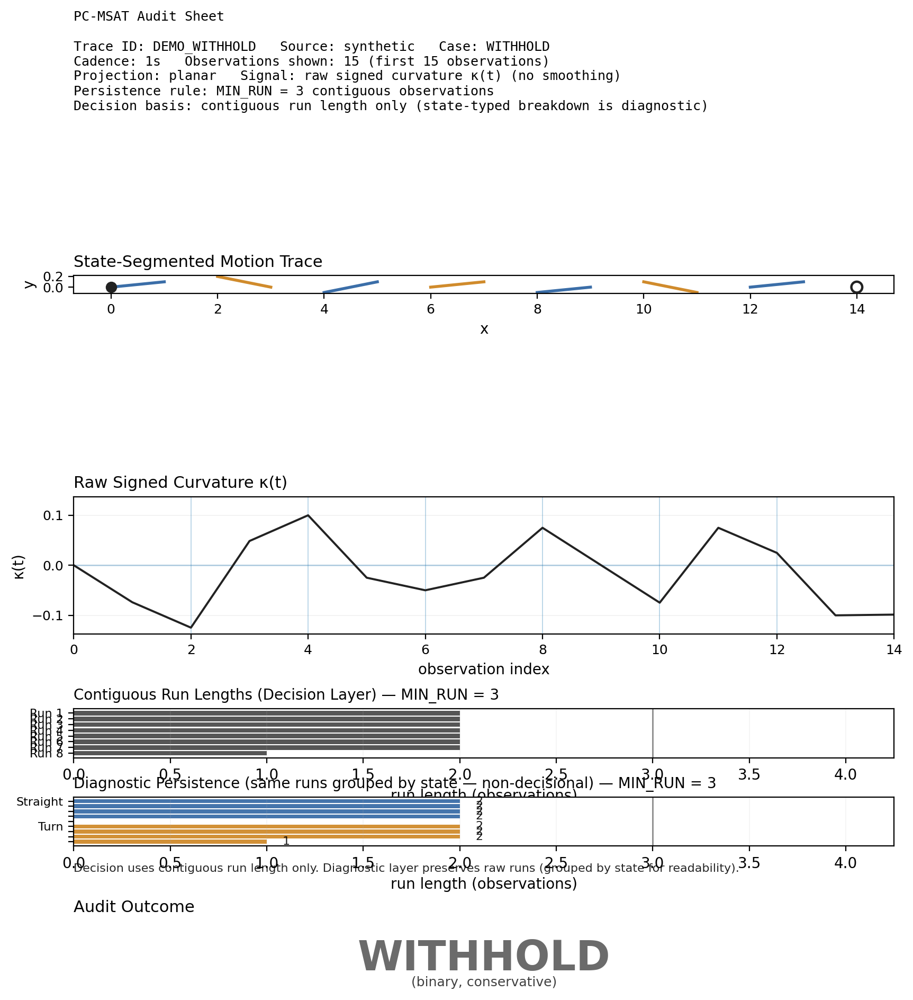
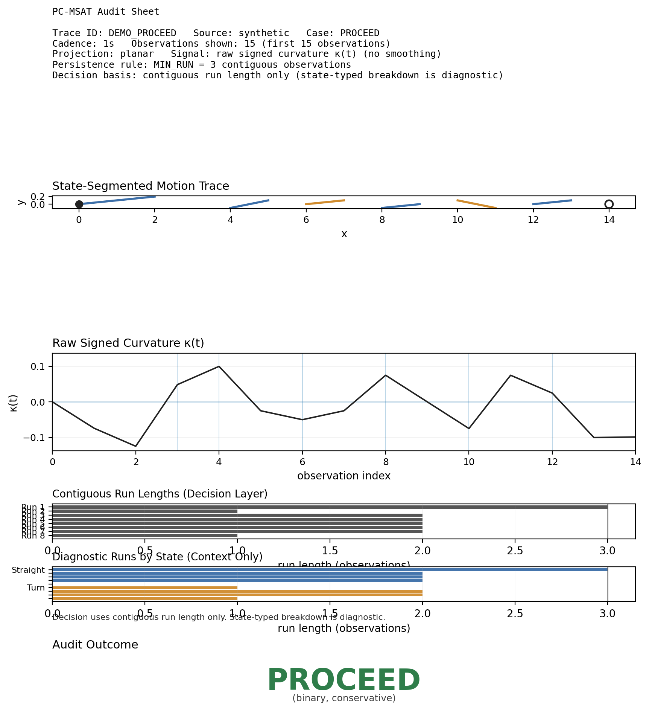

# PC-MSAT — Pre-Classification Motion Structure Audit Tool

*Disclosure-oriented audit interface for geometry-first motion analysis outputs*

PC-MSAT (Pre-Classification Motion Structure Audit Tool) is a geometry-first audit interface used to evaluate whether a motion trace contains sufficient geometric persistence to justify downstream analysis.

The audit operates upstream of classification or interpretation systems. It inspects a state-segmented motion trace and associated geometric signals to determine whether structural support is present.

PC-MSAT produces one of two outcomes:

- **PROCEED** — persistence meets the minimum structural threshold.
- **WITHHOLD** — geometric support is insufficient for further analysis.

PC-MSAT prioritizes restraint: when geometric persistence is insufficient, the audit explicitly withholds downstream analysis.

---

## Overview

PC-MSAT (Pre-Classification Motion Structure Audit Tool) is an interface layer used to inspect **state-segmented motion traces** produced by geometry-first segmentation methods.

One framework capable of producing such traces is **Structured Orb Dynamics (SOD)**.

PC-MSAT presents those traces in an **audit context** to determine whether sufficient structure exists to justify proceeding to downstream analysis.

This repository documents the **PC-MSAT audit interface** and provides visual artifacts demonstrating its application.

PC-MSAT is designed to expose whether motion structure is **geometrically and persistently supported** under fixed criteria, or whether such support is **insufficient and therefore withheld**.

---

## PC-MSAT Audit Layout

```text
┌─────────────────────────────────────────────┐
│ Panel 1 — State-Segmented Motion Trace      │
│                                             │
│ Equal-aspect spatial trajectory showing     │
│ state segmentation along the motion path.   │
├─────────────────────────────────────────────┤
│ Panel 2 — Raw Curvature κ(t)                │
│                                             │
│ Supporting geometric signal plotted         │
│ against observation index.                  │
├─────────────────────────────────────────────┤
│ Panel 3 — Persistence Panel                 │
│                                             │
│ Contiguous segment run lengths relative     │
│ to the minimum persistence requirement.     │
├─────────────────────────────────────────────┤
│ Panel 4 — Audit Outcome                     │
│                                             │
│ PROCEED  — persistence threshold satisfied  │
│ WITHHOLD — insufficient geometric support   │
└─────────────────────────────────────────────┘
```

---

## Reference Audit Artifacts

The repository includes a paired demonstration of the PC-MSAT audit interface.

These artifacts are produced using identical rules, layout, and thresholds. They differ only in whether the motion trace provides sufficient persistence support to justify proceeding.

### Withhold Case



### Proceed Case



Both artifacts illustrate how PC-MSAT exposes motion structure while preserving a conservative audit posture.

---

## Sandbox Demonstrations

A bounded experimental sandbox is available within this repository for exploring how the PC-MSAT audit interface behaves across varied motion traces under fixed constraints.

The sandbox contains a small demonstration suite illustrating how persistence governs the **PROCEED / WITHHOLD** decision logic while preserving the canonical audit posture.

See:

`sandbox/README.md`

---

## Publication Posture

PC-MSAT is published as an **interface specification and audit layout**, not as a packaged software product.

The purpose of this repository is to document the structure of a **Pre-Classification Motion Structure Audit**, including the signals, visual layout, and decision rubric used to evaluate whether a motion trace provides sufficient geometric persistence to justify proceeding to downstream analysis.

Accordingly, this repository is specification-first. It prioritizes **documentation, audit layout standards, and reproducible visual artifacts**.
Any implementation material that may appear in this repository should be understood as a **reference realization of the specification**, not as a canonical or authoritative operational system.

This posture reflects the role PC-MSAT is designed to play within the Structured Orb Dynamics (SOD) ecosystem:

- PC-MSAT is an **audit interface**, not a model
- PC-MSAT is a **disclosure surface**, not a detection system
- PC-MSAT is a **methodological contract**, not an operational pipeline component

By publishing the audit interface as a specification rather than a packaged tool, the emphasis remains on **transparency, reproducibility, and interpretive restraint**.
The repository defines **what evidence should be exposed and how it should be presented**, allowing observers to assess whether motion structure is sufficiently supported under fixed geometric criteria.

Where such support is absent, the appropriate outcome is **withholding**, rather than forced interpretation.

Future implementations of the PC-MSAT interface — whether developed here as reference material or independently by downstream users — should be understood as **realizations of this audit specification**, not as claims of detection, prediction, or operational decision authority.

---

## Overview

PC-MSAT (Pre-Classification Motion Structure Audit Tool) is an interface layer used to inspect **state-segmented motion traces** produced by geometry-first segmentation methods.

One framework capable of producing such traces is **Structured Orb Dynamics (SOD)**.

PC-MSAT presents those traces in an **audit context** to determine whether sufficient structure exists to justify proceeding to downstream analysis.

This repository documents the **PC-MSAT audit interface** and provides visual artifacts demonstrating its application.

PC-MSAT is designed to expose whether motion structure is **geometrically and persistently supported** under fixed criteria, or whether such support is **insufficient and therefore withheld**.

---

## Reference Audit Artifacts

The repository includes a paired demonstration of the PC-MSAT audit interface.

These artifacts are produced using identical rules, layout, and thresholds. They differ only in whether the motion trace provides sufficient persistence support to justify proceeding.

### Withhold Case


### Proceed Case


Both artifacts illustrate how PC-MSAT exposes motion structure while preserving a conservative audit posture.

---

## What PC-MSAT Is

PC-MSAT is:

- an **interface**, not a model
- an **audit surface**, not a detector
- a **disclosure mechanism**, not an interpretation system

Specifically, PC-MSAT presents **State-Segmented Motion Traces** together with a **single supporting geometric signal (raw curvature)** in a standardized audit layout.

This layout allows an observer to assess whether sufficient persistence exists to justify *proceeding* to downstream analysis — or whether restraint (*withholding*) is required.

Audit outcomes are **binary and conservative**.

| Outcome | Description |
|---------|-------------|
| **Withhold** | Insufficient geometric support under fixed persistence criteria. |
| **Proceed** | A contiguous segment satisfies the same criteria. |

These outcomes are **not measures of success or failure**. They indicate only whether structural support exists for further analysis.

---

## What PC-MSAT Is Not

PC-MSAT is **explicitly not**:

- a classifier
- a predictor
- a detector
- a decision system
- a recommendation engine

PC-MSAT does **not**:

- assert physical cause
- infer intent or behavior
- optimize parameters
- evaluate performance
- justify downstream action

When motion structure is ambiguous or insufficiently persistent, PC-MSAT **withholds** rather than forcing interpretation.

---

## Audit Pipeline

```
Trajectory Data
↓
Segmentation Method
(e.g., SOD or other)
↓
State-Segmented Motion Trace
↓
PC-MSAT Audit
↓
PROCEED / WITHHOLD
```

---

## Relationship to Structured Orb Dynamics (SOD)

PC-MSAT operates on **state-segmented motion traces**.

One framework capable of producing such traces is **Structured Orb Dynamics (SOD)**, a geometry-first state-based motion segmentation method.

- SOD defines a **geometry-first, state-based method** for motion analysis
- PC-MSAT defines **how those outputs are exposed and audited**

PC-MSAT introduces **no new inference and performs no additional analysis** beyond what is already present in the **State-Segmented Motion Trace**.

Its purpose is to demonstrate how restraint and withholding can be preserved at the interface level.

---

## Repository Structure

```text
spec/
  pcmsat_v0_spec.md
  renderer-blueprint.md
  paired-demo-data-selection-protocol.md

renderer/
  render_pcmsat_audit.py

data/
  proceed_demo_trace.csv
  withhold_demo_trace.csv

visuals/
  proceed_demo.png
  withhold_demo.png
```

| Directory | Contents |
|-----------|----------|
| `spec/` | PC-MSAT interface rules and demonstration protocols |
| `renderer/` | Minimal reference renderer producing the audit sheet layout |
| `data/` | Paired synthetic traces used for reference demonstration |
| `visuals/` | Rendered audit sheet artifacts produced from the specification |

---

## PC-MSAT Audit Sheet

Each audit artifact follows a fixed layout designed for transparency. The sheet contains:

### State-Segmented Trajectory
Spatial motion trace rendered under equal-aspect constraints.

### Supporting Geometric Signal
Raw curvature κ(t) plotted against observation index.

### Persistence Panel
A compact visualization of contiguous segment lengths relative to the minimum persistence requirement.

### Audit Outcome
A conservative result indicating whether interpretation should proceed or be withheld.

All figures are produced under identical rules and styling so that differences arise only from the underlying motion data.

---

## Reproducibility

The paired demonstration artifacts can be regenerated from the reference renderer using the following commands.

**Proceed case:**

```bash
python renderer/render_pcmsat_audit.py \
  --csv data/proceed_demo_trace.csv \
  --trace-id DEMO_PROCEED \
  --source synthetic \
  --case PROCEED \
  --cadence 1s \
  --n-shown 15 \
  --window-rule "first 15 observations" \
  --out visuals/proceed_demo.png
```

**Withhold case:**

```bash
python renderer/render_pcmsat_audit.py \
  --csv data/withhold_demo_trace.csv \
  --trace-id DEMO_WITHHOLD \
  --source synthetic \
  --case WITHHOLD \
  --cadence 1s \
  --n-shown 15 \
  --window-rule "first 15 observations" \
  --out visuals/withhold_demo.png
```

These paired artifacts are generated under fixed layout rules, shared renderer constraints, and the same persistence threshold (`MIN_RUN = 3`).

---

## Scope and Limitations

PC-MSAT is intentionally narrow in scope.

It does not attempt to:

- resolve ambiguity
- explain motion origin
- rank hypotheses
- replace downstream systems
- influence downstream conclusions

Its sole function is to answer a constrained question:

> *Is there sufficient, persistence-supported geometric structure to justify proceeding — or should interpretation be withheld?*

---

## Licensing

All documentation, text, and visual artifacts in this repository are licensed under:

**Creative Commons Attribution–NonCommercial–NoDerivatives 4.0 International**
(CC BY-NC-ND 4.0)

See the `LICENSE` file for full terms.

---

## Citation and Use

PC-MSAT materials may be shared and cited for non-commercial, non-derivative purposes with attribution.

Use of these materials does not imply endorsement, correctness, or applicability to any specific domain or downstream system.

---

## Status

PC-MSAT is provided as a **reference demonstration interface**.

It is not a packaged software product and is not expected to evolve rapidly.

Changes, when made, will be deliberate and documented.